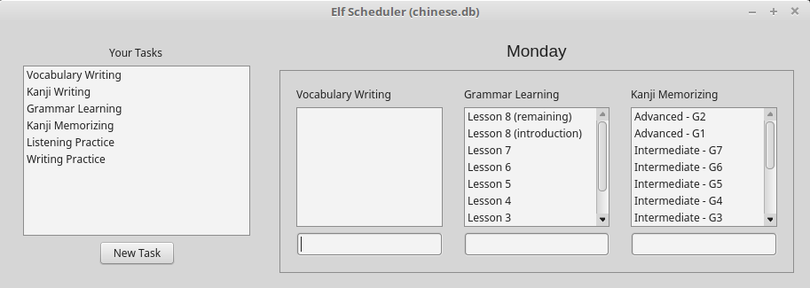

# ElfScheduler


Simple scheduler for keeping track of a group of tasks that should be executed in different days of a week.

The application was mainly developed for use in learning a new spoken language. Take chinese, for example; for learning it effectively you'd need to be well organized with executing a bunch of tasks such as practicing how to write their weird characters, or even verifying your memory on how well you can recall all of a given set of hanzi/kanji.

So, for explaining how the app works, suppose you've divided your tasks for learning chinese in:

- Vocabulary writing: There is a big set of words, which are a set of 1 or more chinese characters; and you've split them into N smaller groups of words. You'd like to: 1) progressively practice all the sets you consider as 'learned'; and 2) be always learning, say, 3 sets.

- Hanzi writing: Similar to the above, but now it's sets of chinese characters. Instead of learning them, you now merely wants to practice how to write the hanzi in the sets you consider as 'learned'.

- Hanzi memorizing: Similar to the above, but now you want to: 1) verify your memory on 'memorized' sets; and 2) memorize new sets.

- Grammar learning: You're following a grammar book, progressively lesson by lesson.

- Listening practice: You have a set of dialogues to listen to. Nothing much to talk here, as it's not the focus of the application.

- Writing practice: You write some paragraphs about various subjects, just to practice your writing skills; also not the application focus.

Then, given these tasks, you'd like to split them into different days of the week, as a matter of organization. Also, you'd like some form of storing your current state in a given task, so that you know what to do on the next time you perform that task. For example, hanzi writing involves practicing sets of characters in a circular manner: say you have learned 8 sets, you'd like to practice sets 1-3 on one day, and then 4-6 on the next day, then sets 7, 8 and 1 on the next day; to decide which sets to study on that day, you'll need to know what sets you've practice last. That's the main purpose of Elf Scheduler.

What Elf Scheduler provides is:

- You can have multiple schedules, one for chinese and one for japanese, for example.

- Each schedule contains tasks, and you can specify what days of the week that task should be performed on.

- For each task, if it is a task that should be performed today, then it is presented on the graphical interface as a list of entries, and each entry is something like "hanzi group 3" where you specify what the last activity performed for that task was. The entries are shown in the order they are inserted, from most recent to the oldest. Entries can be inserted through the graphical interface.

The following image represent an example:



# Usage

Elf Scheduler begins as a command line tool. To execute it, you can run:

```
$ ./elfscheduler [args]
```

If no arguments are provided, it tries to load the last schedule opened. To open an existing schedule, or to create a new schedule, run:

```
$ ./elfscheduler chinese
```

This would create the schedule 'chinese'. The schedule names are currently case-sensitive.

The interface is very intuitive. On the **right pane**, the tasks that should be executed today will appear; note that if it's earlier than 6am, then the current day is set to be the previous day (I'm a late sleeper). You can add new entries to each task by typing on the editable box on the bottom of the list of entries; type ENTER to submit.

On the **left pane** of the interface, there should be a list of tasks on your schedule, you can edit each of them by double-clicking them; add new ones through the button on the bottom.

# Building

The program was developed using Qt version 5, so any QtCreator with support for version 5 will be able to build this project.

# Internals

Each schedule is a SQLite3 database, and its .db file will be located at the directory .elfscheduler in your HOME folder.

Erasing any .db file implicates on erasing that specific schedule.
